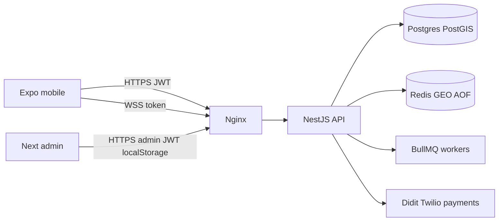

# PingMe — Full API & Stack Penetration Test Plan

> **Status:** Methodology & test plan (authorized self-assessment / contractor brief)  
> **Execution:** Staging run 2026-08-16 — see [pentest-report-2026-08-16.md](./pentest-report-2026-08-16.md)  
> **Target stack:** NestJS + Prisma + PostgreSQL/PostGIS + Redis + Socket.IO + JWT + nginx + Expo mobile + Next.js admin  
> **API prefix:** `/v1`  
> **Created:** August 2026  
> **Scope rule:** Test only environments you own (local / staging). Never run against production users without written authorization and a defined window.

This document is a **defensive pentest plan**: what to inventory, what to attempt with *two controlled test accounts*, what “pass” looks like, and how findings map to standards. It is **not** a weaponized exploit kit. Live execution against staging is a separate engagement (Phase 0 → report).

---

## Table of contents

1. [Research basis (sources)](#1-research-basis-sources)
2. [Objectives & rules of engagement](#2-objectives--rules-of-engagement)
3. [PingMe stack threat model](#3-pingme-stack-threat-model)
4. [Environment & tooling](#4-environment--tooling)
5. [Chapter A — Reconnaissance & inventory (API9)](#5-chapter-a--reconnaissance--inventory-api9)
6. [Chapter B — Authentication & session (API2)](#6-chapter-b--authentication--session-api2)
7. [Chapter C — Object authorization / IDOR / BOLA (API1)](#7-chapter-c--object-authorization--idor--bola-api1)
8. [Chapter D — Property-level auth & mass assignment (API3)](#8-chapter-d--property-level-auth--mass-assignment-api3)
9. [Chapter E — Function-level auth / BFLA (API5)](#9-chapter-e--function-level-auth--bfla-api5)
10. [Chapter F — Resource consumption & abuse (API4, API6)](#10-chapter-f--resource-consumption--abuse-api4-api6)
11. [Chapter G — Injection, raw SQL, PostGIS](#11-chapter-g--injection-raw-sql-postgis)
12. [Chapter H — File upload & static media](#12-chapter-h--file-upload--static-media)
13. [Chapter I — WebSocket / Socket.IO](#13-chapter-i--websocket--socketio)
14. [Chapter J — Location, privacy & dating-app class risks](#14-chapter-j--location-privacy--dating-app-class-risks)
15. [Chapter K — Webhooks & third-party trust (API7, API10)](#15-chapter-k--webhooks--third-party-trust-api7-api10)
16. [Chapter L — Admin panel & CSP](#16-chapter-l--admin-panel--csp)
17. [Chapter M — Misconfiguration, headers, nginx, Redis, ops (API8)](#17-chapter-m--misconfiguration-headers-nginx-redis-ops-api8)
18. [Chapter N — Business-logic & PingMe-specific flows](#18-chapter-n--business-logic--pingme-specific-flows)
19. [Chapter O — Regression vs Parts 1–4 hardening](#19-chapter-o--regression-vs-parts-14-hardening)
20. [Execution phases & schedule](#20-execution-phases--schedule)
21. [Evidence, severity & reporting template](#21-evidence-severity--reporting-template)
22. [Pass criteria for soft launch](#22-pass-criteria-for-soft-launch)

---

## 1. Research basis (sources)

Plan chapters draw on **20+ independent references** (standards, vendor docs, research, and stack-specific guides):

| # | Source | Focus |
|---|--------|--------|
| 1 | [OWASP API Security Top 10 2023](https://owasp.org/API-Security/editions/2023/en/0x11-t10/) | Canonical API risk taxonomy |
| 2 | [AccuKnox OWASP API testing checklist](https://accuknox.com/blog/owasp-api-security-top-10-the-complete-testing-checklist-2026) | Evidence-oriented test checklist |
| 3 | [QASkills OWASP API testing guide](https://qaskills.sh/blog/owasp-api-security-top-10-testing-guide-2026) | Manual BOLA/BFLA technique |
| 4 | [Strobes API pentest checklist](https://strobes.co/blog/api-penetration-testing-checklist/) | Phased discovery → auth → logic |
| 5 | [nflo OWASP API Top 10 guide](https://nflo.tech/knowledge-base/owasp-api-security-top-10-2023-complete-guide/) | 12-step API pentest flow |
| 6 | [OWASP Secure Agent API review play](https://github.com/OWASP/secure-agent-playbook/blob/main/plugins/code-security-skills/plays/api-security-review.md) | Structured API assessment playbook |
| 7 | [OWASP REST Security Cheat Sheet](https://cheatsheetseries.owasp.org/cheatsheets/REST_Security_Cheat_Sheet.html) | REST defaults (methods, TLS, CORS) |
| 8 | [OWASP ASVS 5.0](https://github.com/OWASP/ASVS) / [V4 API chapter](https://asvs.dev/v5.0.0/V4-API-and-Web-Service/) | Verification requirements L1–L3 |
| 9 | [PortSwigger JWT algorithm confusion](https://portswigger.net/web-security/jwt/algorithm-confusion) | JWT verifier misuse |
| 10 | [CerberAuth JWT HMAC confusion](https://www.cerberauth.com/docs/jwtop/vulnerabilities/jwt-hmac-confusion/) | Alg pinning guidance |
| 11 | [Payload Playground JWT confusion](https://payloadplayground.com/blog/jwt-algorithm-confusion-attacks) | `none` / confusion family overview |
| 12 | [Simpa Labs NestJS pentest guide](https://www.simpalabs.com/blog/nestjs-api-penetration-testing-guide) | ValidationPipe / mass assignment |
| 13 | [middleBrick NestJS security](https://middlebrick.com/security/frameworks/nestjs) | Guards, throttling, JWT pitfalls |
| 14 | [Encore NestJS auth guide](https://encore.dev/articles/nestjs-authentication-guide) | Refresh hashing, guard coverage |
| 15 | [reverseBits Next+Nest security](https://www.reversebits.tech/blog/nextjs-nestjs-security/) | Token storage, parameterized DB |
| 16 | [Prisma SQL injection discussion](https://github.com/prisma/prisma/discussions/19533) | Safe ORM vs `$queryRawUnsafe` |
| 17 | [Shoulder Prisma mass assignment](https://shoulder.dev/rules/prisma-mass-assignment) | `req.body` → Prisma risk |
| 18 | [AuditBuffet mutating route validation](https://auditbuffet.com/patterns/ab-000276) | Whitelist before create/update |
| 19 | [Socket.IO middlewares](https://socket.io/docs/v4/middlewares/) | Handshake vs per-event auth |
| 20 | [NetworkSpy Socket.IO auth](https://networkspy.app/blog/socketio-authentication-middleware-cors-origin-guide) | Origin / CORS / event auth |
| 21 | [Systems Hardening WebSocket](https://www.systemshardening.com/articles/network/websocket-hardening/) | CSWSH, message rate limits |
| 22 | [nginx WebSocket proxy docs](https://nginx.org/en/docs/http/websocket.html) | Upgrade headers / timeouts |
| 23 | [nginx rate limiting blog](https://blog.nginx.org/blog/rate-limiting-nginx) | Edge throttling |
| 24 | [OneUptime Redis SSRF hardening](https://oneuptime.com/blog/post/2026-03-31-redis-how-to-prevent-redis-unauthorized-access-ssrf-protection/view) | Bind, auth, dangerous commands |
| 25 | [USENIX LBD privacy paper](https://www.usenix.org/system/files/usenixsecurity24-dhondt.pdf) | Dating-app location / API leaks |
| 26 | [TechCrunch Raw IDOR](https://techcrunch.com/2025/05/02/dating-app-raw-exposed-users-location-data-and-personal-information/) | Profile IDOR + precise location |
| 27 | [TechCrunch Bumble/Hinge trilateration](https://techcrunch.com/2024/07/31/bumble-and-hinge-allowed-stalkers-to-pinpoint-users-locations-down-to-2-meters-researchers-say/) | Distance-oracle attacks |
| 28 | [Twilio webhook security](https://www.twilio.com/docs/usage/webhooks/webhooks-security) | Signature validation |
| 29 | [webhooks.cc webhook security](https://webhooks.cc/blog/webhook-security-ssrf-replay-signature-bypass) | Replay, timing-safe compare |
| 30 | [Valtik webhook forgery](https://www.valtikstudios.com/blog/webhook-forgery-stripe-twilio-sendgrid) | Common signature bugs |
| 31 | [securityscanner Stripe webhook study](https://securityscanner.dev/blog/stripe-webhook-signature-bypass-1500-apps) | Unsigned webhook acceptance |

Cross-reference internal hardening: [`docs/engineering/fixes.md`](../engineering/fixes.md).

---

## 2. Objectives & rules of engagement

### Goals

1. Prove whether an unauthenticated or low-privilege caller can **read or mutate another user’s data** (BOLA/IDOR).
2. Prove whether **auth, refresh, OTP, admin, and webhooks** can be bypassed or abused.
3. Prove whether **location / presence / wall / icebreaker** leak precise coordinates or enable stalking-class trilateration.
4. Prove whether **WS, uploads, Redis, and nginx** can be abused for DoS, hijack, or data exposure.
5. Produce a prioritized findings list with remediation owners.

### In scope

- Staging API (`/v1/*`), Socket.IO `/ws`, admin API, static `/v1/uploads` and `/v1/legal`
- Staging Redis/Postgres **configuration exposure** (ports, auth) — no destructive wipe without backup
- Mobile/admin **client trust** assumptions (extra JSON fields, spoofed headers)

### Out of scope (unless explicitly expanded)

- Third-party services themselves (Didit, Twilio, Stripe) beyond *our* webhook handlers
- Physical device jailbreak / binary reverse of Expo builds (optional later)
- Social engineering of real users
- Production traffic or production credentials

### Ethics

- Use only **seed / dedicated tester accounts** (User A, User B, Admin).
- Cap automated traffic; prefer Nest throttles as under-test, not as something to overwhelm the VPS into outage.
- Document every finding with request/response evidence; do not store other users’ PII off-box.

---

## 3. PingMe stack threat model



| Asset | Why attackers care | Likely attack classes |
|-------|--------------------|------------------------|
| User JWT + refresh | Account takeover | Token theft, reuse, alg abuse, race |
| Admin JWT (localStorage) | Full moderation power | XSS → token theft, BFLA |
| Chat / match IDs | Private messages | BOLA on `/chats/:id` |
| Presence / nearby | Physical safety | Precise lat/lng leak, trilateration |
| Wall / icebreaker | Harassment, spam | Automation of sensitive flows |
| Uploads | Malware hosting / path escape | Traversal, content-type spoof |
| Webhooks | Fake premium / fake liveness | Unsigned or replayed events |
| Redis | Sessions, GEO, rate keys | Network exposure, SSRF pivot |
| WS `/ws` | Bypass HTTP limits | CSWSH, unauth connect, flood |

**Trust boundaries:** mobile is untrusted; JWT `sub` is the only identity; never trust body `userId`, `role`, or client lat/lng for *authorization*.

---

## 4. Environment & tooling

| Tool | Use |
|------|-----|
| curl / httpie | Scripted endpoint checks |
| Burp Suite Community / OWASP ZAP | Proxy, replay, Intruder |
| jwt.io / custom script | Decode access tokens (do not paste prod secrets) |
| wscat / Postman WS | Socket.IO handshake & events |
| nmap (staging only) | Confirm Postgres/Redis not public |
| Two phones or two emulators | Real geo + push flows |

**Prep:**

1. Create **User A** and **User B** (verified + unverified variants).
2. Create one **admin** and one **moderator** if roles differ.
3. Capture OpenAPI from staging **only if** Swagger is enabled (should be **off** in production).
4. Export a private evidence folder: `pentest-evidence/YYYY-MM-DD/`.

---

## 5. Chapter A — Reconnaissance & inventory (API9)

### What to inventory

Build a spreadsheet of every reachable route:

| Method | Path | Auth | Public? | Notes |
|--------|------|------|---------|-------|
| … | `/v1/...` | user / admin / none | Y/N | |

### Must-find surfaces (PingMe)

- Auth: `register`, `login`, `refresh`, `logout`, OTP send/verify, forgot/reset
- Users/media: `users/me`, media presign/upload/confirm
- Wall, matches, chats, presence, icebreaker
- Devices, notifications, subscriptions, verification
- Safety: report/block
- Admin: `/v1/admin/**`
- Public: `health`, `config`, webhooks, legal static, uploads static
- WS: namespace `/ws`, events `ping`, `message.send`, `message.read`

### Tests

| ID | Test | Pass criteria |
|----|------|---------------|
| A1 | Enumerate methods on each path (`OPTIONS`, `TRACE`, `PUT` where only `POST`) | Unused methods rejected |
| A2 | Hit `/docs`, `/swagger`, `/graphql`, `/.env`, `/v1/docs` on staging+prod | No Swagger in production |
| A3 | Compare mobile-called routes vs server controllers | No undocumented shadow routes |
| A4 | Version confusion: `/v1` vs `/v2` vs bare `/auth/login` | Only intended prefix works |
| A5 | Host header / absolute URL tricks behind nginx | No cache poison / weird redirects |

### Extra parameters / fingerprinting

Send baseline requests with:

- Unknown JSON keys (`"__proto__": {}`, `"constructor": {}`, `"role": "admin"`)
- Duplicate keys if proxy allows
- Extremely large headers / cookies
- `X-User-Id`, `X-Forwarded-User`, `X-Role` spoof headers

**Pass:** ignored or 400; never change identity or privilege.

---

## 6. Chapter B — Authentication & session (API2)

### B1 — Registration / login

| ID | Test | Pass |
|----|------|------|
| B1.1 | Register without email/phone; underage DOB; duplicate identity | 400 / conflict |
| B1.2 | Login with wrong password × N | Throttle / lock behavior documented |
| B1.3 | Login response never returns `passwordHash` | Sanitized user |
| B1.4 | SQL/NoSQL-ish strings in email/password | Safe errors, no 500 stack traces in prod |
| B1.5 | Extra fields on register (`status`, `isAvailable`, `role`) | Rejected (`forbidNonWhitelisted`) |

### B2 — JWT access token

| ID | Test | Pass |
|----|------|------|
| B2.1 | Truncate / flip signature bits | 401 |
| B2.2 | Change `alg` to `none` / `None` / `NONE` | 401 |
| B2.3 | Tamper `sub` claim, resign with wrong secret | 401 |
| B2.4 | Expired token | 401 |
| B2.5 | Use **admin** JWT on user routes and vice versa | 401 |
| B2.6 | Soft-deleted / suspended user with still-valid JWT | 401 (HTTP + WS disconnect) |

### B3 — Refresh rotation / reuse (critical for PingMe)

| ID | Test | Pass |
|----|------|------|
| B3.1 | Valid refresh → new access + new refresh; old refresh fails | Atomic rotate |
| B3.2 | Parallel double refresh (two clients, same token) | At most one succeeds; reuse path revokes family |
| B3.3 | Replay already-revoked refresh | “Session revoked” + all sessions dead |
| B3.4 | Refresh for deleted user | 401 |

### B4 — OTP / reset

| ID | Test | Pass |
|----|------|------|
| B4.1 | Brute 6-digit OTP beyond 5 attempts | Lockout / used |
| B4.2 | OTP send spam | 5/min throttle |
| B4.3 | Forgot-password enumeration | Same generic message for exist/missing |
| B4.4 | Phone-only forgot sends SMS path (staging) | Token delivered without email |
| B4.5 | Reset with weak password | Rejected by strong password rules |
| B4.6 | Reset token reuse | Second use fails |

### B5 — Admin login

| ID | Test | Pass |
|----|------|------|
| B5.1 | Admin login throttle 5/min | 429 |
| B5.2 | User JWT cannot call admin routes | 401/403 |
| B5.3 | Long-lived admin token theft scenario (XSS) | Document residual risk (localStorage) |

---

## 7. Chapter C — Object authorization / IDOR / BOLA (API1)

**Method (dating-app proven pattern):** Authenticate as A, capture object IDs belonging to B (or create them), replay A’s token with B’s IDs.

### Priority object IDs

| Object | Example endpoints | Expectation |
|--------|-------------------|-------------|
| Chat | `GET /chats/:id`, messages, send, read, close | Only match participants |
| Match | `GET/POST matches/*` | Only parties to the match |
| Wall post / reply | detail, report, match-from-reply | Public read OK; mutate/report rules enforced |
| User profile | any `/users/:id` if exists | No private fields / no email/phone |
| Device | delete by token | Only own device |
| Verification session | status endpoints | Only own user |
| Subscription | checkout confirm | Only own user |
| Upload key | media confirm / static URL | Cannot overwrite others’ keys |

### Tests

| ID | Test | Pass |
|----|------|------|
| C1 | A reads B’s chat by UUID | 403/404 |
| C2 | A sends message into B’s chatId | 403/404 |
| C3 | A marks B’s messages read | 403/404 |
| C4 | A accepts/declines B’s match meant for C | Fail |
| C5 | A deletes B’s account / updates B profile via body `userId` | Fail |
| C6 | Enumerate sequential vs UUID predictability | UUIDs only; still enforce authz |
| C7 | Change HTTP method (GET→DELETE) on chat | Fail closed |

---

## 8. Chapter D — Property-level auth & mass assignment (API3)

Nest global pipe uses `whitelist` + `forbidNonWhitelisted` — **verify in practice**.

| ID | Endpoint class | Inject fields | Pass |
|----|----------------|---------------|------|
| D1 | `PATCH` profile/settings | `passwordHash`, `status`, `deletedAt`, `isAvailable`, relation connects | 400 |
| D2 | Register / login | `id`, `role`, `emailVerified` | 400 |
| D3 | Wall create | `userId`, `expiresAt` far future bypass if business forbids | Rejected or ignored safely |
| D4 | Presence ping | Negative absurd coords, NaN, string types | 400 |
| D5 | Response review | No `passwordHash`, refresh hashes, internal admin notes on public DTOs | Hidden |

Also check **excessive data exposure**: nearby/wall responses must not include exact lat/lng, email, phone, raw DOB if policy forbids.

---

## 9. Chapter E — Function-level auth / BFLA (API5)

| ID | Test | Pass |
|----|------|------|
| E1 | User token → every `/v1/admin/**` route | 401/403 |
| E2 | Moderator vs super_admin role matrix | Privilege boundaries hold |
| E3 | Call VerifiedGuard-protected writes without liveness | 403 `LIVENESS_REQUIRED` when enforcement on |
| E4 | Toggle enforcement off in staging only; confirm prod flag | Prod cannot be flipped by client |
| E5 | Direct worker/internal URLs if any exposed | Not reachable publicly |

---

## 10. Chapter F — Resource consumption & abuse (API4, API6)

### Rate limits

| ID | Surface | Test | Pass |
|----|---------|------|------|
| F1 | Global 120/min | Burst scripts | 429 |
| F2 | Auth endpoints | Parallel login/register | Per-route limits |
| F3 | OTP / reset | Flood | 5/min |
| F4 | Presence / nearby / wall list | Tight loops | Caps + no unbounded memory |
| F5 | WS connect / `message.send` | Flood | App-level limits |

### Pagination / payload

| ID | Test | Pass |
|----|------|------|
| F6 | `limit=999999` on wall/chats/nearby | Server clamps (e.g. max 50–100) |
| F7 | Huge JSON body (>10mb) | Rejected |
| F8 | Chat message > 2000 chars (HTTP + WS) | Rejected |
| F9 | Deeply nested JSON | Safe fail |

### Sensitive business flows (API6)

Automate (with caps) and record whether the product is abusable:

- Mass wall posts / icebreaker interests / match requests
- Checkout confirm spam (demo disabled in prod)
- Account creation farm

**Pass:** throttles + verification gates + meaningful cost/friction.

---

## 11. Chapter G — Injection, raw SQL, PostGIS

Prisma Client queries are generally parameterized; **raw** paths need scrutiny.

| ID | Test | Pass |
|----|------|------|
| G1 | Classic SQLi payloads in login, search, displayName, bio | No data leak / no 500 SQL text |
| G2 | Review all `$queryRaw` / `$executeRaw` / `Unsafe` usages | Tagged templates only; user input bound |
| G3 | PostGIS distance params (radius, lat, lng) | Numeric validation; no string concat |
| G4 | Filter/order injection if any dynamic `orderBy` from client | Whitelisted columns only |

---

## 12. Chapter H — File upload & static media

| ID | Test | Pass |
|----|------|------|
| H1 | Path traversal in object keys (`../`, encoded variants) | Rejected (Part 1 control) |
| H2 | Upload non-image / polyglot / oversized (>5MB) | Rejected |
| H3 | Content-Type spoof vs magic bytes | Safe handling |
| H4 | Guess other users’ `/v1/uploads/...` URLs | Prefer non-guessable keys; no listing |
| H5 | Confirm media for another user’s key | Fail |
| H6 | When R2 off: public static still cannot escape uploads root | Contained |

---

## 13. Chapter I — WebSocket / Socket.IO

### Handshake

| ID | Test | Pass |
|----|------|------|
| I1 | Connect without token | Disconnect |
| I2 | Token in `auth` vs `query` (query may leak in logs) | Prefer auth; document risk if query allowed |
| I3 | Expired / suspended / deleted JWT | Disconnect |
| I4 | Origin not in CORS allowlist | Rejected |
| I5 | Non–Socket.IO raw WS client behavior | Still cannot skip auth meaningfully |

### Events

| ID | Test | Pass |
|----|------|------|
| I6 | `message.send` to another user’s chatId | Fail |
| I7 | Oversized message | Fail |
| I8 | Missing fields / wrong types | Fail closed |
| I9 | Flood `message.send` / connects | Rate limited |
| I10 | Subscribe/join arbitrary rooms if client can | Server-only room joins |

---

## 14. Chapter J — Location, privacy & dating-app class risks

Inspired by USENIX LBD research and public dating-app breaches.

| ID | Test | Pass |
|----|------|------|
| J1 | Nearby / wall / icebreaker API responses contain only fuzzy or bucketed distance | No raw lat/lng to other users |
| J2 | Presence status for self may show fuzzy; never expose others’ precise coords | Confirmed |
| J3 | After go-unavailable / expiry, precise DB coords cleared (Part 4) | Null precise fields |
| J4 | Trilateration oracle: many nearby queries from crafted points | Rate limits + fuzzy storage reduce precision |
| J5 | Deleted users absent from wall/geo | Hidden |
| J6 | Blocked users excluded from discovery/chat | Enforced |

**Safety note:** Treat precise location bugs as **Critical** even if “only” privacy — physical risk.

---

## 15. Chapter K — Webhooks & third-party trust (API7, API10)

### Payment webhooks

| ID | Test | Pass |
|----|------|------|
| K1 | `POST /v1/webhooks/payments/:provider` without signature | Reject / not configured |
| K2 | `provider=manual` or unknown provider | 404/503 (manual bypass removed) |
| K3 | `PAYMENT_PROVIDER=demo` on production build | Blocked at boot/runtime |
| K4 | Replay old signed event (when Stripe live) | Idempotent + timestamp window |

### Didit verification webhook

| ID | Test | Pass |
|----|------|------|
| K5 | Webhook without valid HMAC | 403 |
| K6 | Duplicate `event_id` | Duplicate short-circuit (SET NX) |
| K7 | Vendor data / session spoof to verify another user | Impossible without signature |
| K8 | Mobile WebView navigates off Didit hosts | Blocked (allowlist) |

### SSRF class

PingMe should have **few** server-side URL fetchers; inventory any (`fetch(userUrl)`).

| ID | Test | Pass |
|----|------|------|
| K9 | If any URL input exists, try loopback / metadata / redis port | Blocked allowlist |
| K10 | Redis/Postgres ports not reachable from public internet | Filtered |

---

## 16. Chapter L — Admin panel & CSP

| ID | Test | Pass |
|----|------|------|
| L1 | CSP / security headers present on admin Next app | Headers observed |
| L2 | XSS in admin-reflected fields (display names in moderation UI) | Escaped; token not exfiltrated easily |
| L3 | localStorage JWT residual risk | Documented; cookie migration backlog |
| L4 | CSRF on cookie-less Bearer admin API | Lower risk; still test state-changing GETs (should not exist) |

---

## 17. Chapter M — Misconfiguration, headers, nginx, Redis, ops (API8)

| ID | Test | Pass |
|----|------|------|
| M1 | Helmet security headers on API responses | Present |
| M2 | CORS: disallowed origin with credentials | Rejected |
| M3 | Error responses in production | No stack traces / SQL |
| M4 | `GET /health` | No `activeAvailableUsers` or other product metrics |
| M5 | `GET /config` | No secrets (JWT, DB, Twilio) |
| M6 | nginx: `/docs` locked/absent in prod | Confirmed |
| M7 | nginx WS timeouts adequate; Upgrade headers set | Stable WS |
| M8 | Redis bound to localhost/private + auth if exposed historically | Not public |
| M9 | Postgres not public; strong password | Confirmed |
| M10 | Backup scripts exist; restore drill documented | Ops ready |
| M11 | Seed cannot run in production without `ALLOW_SEED=1` | Confirmed |

---

## 18. Chapter N — Business-logic & PingMe-specific flows

| ID | Flow | Abuse idea | Pass |
|----|------|------------|------|
| N1 | Match creation race | Parallel create same pair | Partial unique index / conflict handled |
| N2 | Icebreaker mutual interest | Forge interest / skip distance | Server enforces geo + session state |
| N3 | Premium entitlements | Confirm checkout without payment | Demo blocked; webhook signed only |
| N4 | Report/block | Report self / spam reports | Validation + throttle |
| N5 | Account deletion | Soft-delete still discoverable | Scrubbed + hidden |
| N6 | Push device register | Register many tokens for others | Bound to auth user |
| N7 | Liveness gate bypass | Hit wall reply / chat send without verify | Guarded when enabled |

### Extra-parameter manipulation matrix (apply globally)

For every mutating endpoint, send a body that includes:

1. Valid fields **plus** privileged extras (`status`, `role`, `userId`, `userAId`, …)
2. Type confusion (`"limit": "1 OR 1=1"`, arrays where scalars expected)
3. Null vs omit vs empty string for required fields
4. HTTP parameter pollution (`?userId=A&userId=B`) if query used

Record whether Nest returns **400** (preferred) vs silently ignoring vs applying.

---

## 19. Chapter O — Regression vs Parts 1–4 hardening

Explicitly re-test controls already marked Done in [`fixes.md`](../engineering/fixes.md):

| Control | Chapter IDs |
|---------|-------------|
| Upload path safety | H1–H6 |
| JWT fail-closed / Swagger off / no demo pay | B2, A2, K3 |
| Account scrub + hide deleted | N5, J5 |
| Refresh reuse revoke-all | B3 |
| OTP lockout + throttles + phone reset SMS | B4 |
| WS deleted/suspended disconnect | B2.6, I3 |
| Admin login throttle + CSP | B5, L1 |
| Rate-limit Lua, helmet, webhook manual removed | F*, M1, K1–K2 |
| Match active-pair unique | N1 |
| Didit allowlist / health metric removed | K8, M4 |
| Presence precise coord scrub | J3 |

---

## 20. Execution phases & schedule

Suggested **5-day** staging engagement (adjust to depth):

| Day | Focus |
|-----|--------|
| 0 | RoE signed, accounts created, inventory (Ch A), tooling |
| 1 | Auth + admin (Ch B, E, L) |
| 2 | BOLA across chat/match/wall/media (Ch C, D, H) |
| 3 | Presence/geo privacy + WS (Ch I, J) |
| 4 | Webhooks, abuse/DoS, nginx/Redis/config (Ch F, K, M, N) |
| 5 | Regression (Ch O), report write-up, retest fixes |

---

## 21. Evidence, severity & reporting template

### Severity (practical)

| Severity | Examples |
|----------|----------|
| Critical | Auth bypass; admin BFLA; precise live location of others; RCE; unsigned payment webhook grants premium |
| High | Chat IDOR; account takeover via refresh reuse; webhook forgery for liveness |
| Medium | Missing rate limit on costly SMS; verbose errors; CORS misconfig |
| Low | Informational headers; minor enumeration |
| Info | Defense-in-depth suggestions (httpOnly admin cookies) |

### Finding template

```markdown
### [SEVERITY] Title
- OWASP: API1/API2/...
- ASVS: v5.0.0-x.y.z (if mapped)
- Endpoint: METHOD /v1/...
- Precondition: User A token, object owned by B
- Steps: (numbered, reproducible on staging)
- Result: observed vs expected
- Impact: ...
- Evidence: request/response redacted
- Remediation: ...
- Retest: pending/pass
```

---

## 22. Pass criteria for soft launch

Soft-launch gate (aligns with deferred “external pen test” in fixes.md):

1. **Zero Critical / High** open on staging after retest.
2. All Chapter C chat/match IDORs pass.
3. No precise third-party location in API responses; unavailable scrub works.
4. Refresh reuse kills session family.
5. Production: Swagger off, demo payments impossible, JWT secrets strong.
6. Webhooks reject unsigned/`manual` forgery.
7. Public `/health` and `/config` leak no secrets or sensitive metrics.
8. Redis/Postgres not internet-exposed.

---

## Appendix — Endpoint checklist seed (fill during Ch A)

Copy into a sheet and mark Pass/Fail:

- [ ] `POST /v1/auth/register`
- [ ] `POST /v1/auth/login`
- [ ] `POST /v1/auth/refresh`
- [ ] `POST /v1/auth/logout`
- [ ] `POST /v1/auth/verify-email/send` + `verify-email`
- [ ] `POST /v1/auth/verify-phone/send` + `verify-phone`
- [ ] `POST /v1/auth/forgot-password` + `reset-password`
- [ ] `GET/PATCH /v1/users/me` (+ delete)
- [ ] `POST /v1/media/*`
- [ ] Wall CRUD / report / reply / match-from-reply
- [ ] Matches list/accept/decline
- [ ] Chats list/detail/messages/send/read/close
- [ ] Presence ping/available/nearby/status
- [ ] Icebreaker start/nearby/interest
- [ ] Devices register/unregister
- [ ] Subscriptions plans/checkout/confirm/cancel
- [ ] Verification start/status/webhook/callback
- [ ] Safety report/block
- [ ] `GET /v1/health`, `GET /v1/config`
- [ ] `POST /v1/webhooks/payments/:provider`
- [ ] All `/v1/admin/**`
- [ ] Static `/v1/uploads/*`, `/v1/legal/*`
- [ ] WS `/ws` connect + `message.send` + `message.read`

---

## Appendix — Next step after this plan

1. Run this plan against **staging** with User A/B (authorized).
2. File findings into a dated report (e.g. `docs/testing/pentest-report-YYYYMMDD.md`).
3. Fix High+ before public soft launch; schedule external pen test when budget allows (still listed as deferred in engineering fixes board).

*This plan intentionally omits ready-made weaponized payloads for Redis/gopher/RCE chains. Those classes are covered as configuration and SSRF checks suitable for an owned environment.*
